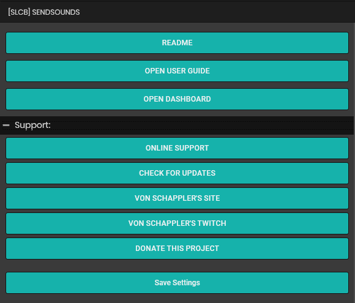
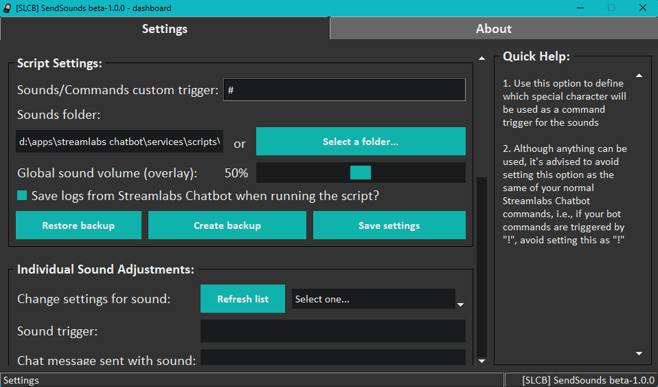

# [SLCB] SendSounds

## Introduction:

This is a Streamlabs Chatbot script mabe by request, created to play sound files to an overlay, simulating a "faux-audio channel" to be added and controlled on **OBS Studio**, making it possible to send those files sent to a specific track within **OBS**.

## Features:

- [x] Graphical overlay to control the scripts and sounds settings
- [x] Uses sqlite database instead of json files for storing sounds information
- [x] Uses bot commands provided with the script
- [x] Sends and optional chat message on stream
- [x] Creation of log files for both **StremlabsSystem** script and the **GUI** (aka Dashboard), organized into specific folders
- [x] "Automatic commands" created when adding new files to the sounds folder and "Saving the settings for the script"
- [x] General Overlay volume control, via the script settings
- [x] Individual sounds volume control, so the user can fix each sound level indivudally
- [x] Possibility to check and fix database issues to prevent the script from stop excecuting if an unexistent file requested to be played
  - By disabling entries on the database
  - By deleting entries from the database
  - By deleting entries which sound files were not found in the defined sounds folder
- [x] Possibility to run the GUI in stand alone mode, by using the command prompt
- [x] Possibility to preview the sound effect volume[^1]
- [x] Compatible with the following streaming platforms:
  - Twitch (100%)

## Requirements:

- Windows 10 or above
- Streamlabs Chatbot 1.0.79 or above
- OBS Studio 29.1.3 or above
- Python packages/dependencies[^2]:
  - **pygame 2.0.3** (optional)

## User guide:

A full guide on how to use the script can be found on [the script wiki](https://github.com/vonschappler/SLCB-SendSounds/wiki/User-Guide).

## Image previews:

### 1. Streamlabs Chatbot GUI:

### 2. Dashboard made with Tkinter:

## Changelog:

- [Version beta-2.0.1](https://github.com/vonschappler/SLCB-SendSounds/releases/tag/beta-2.0.1):
  - Fixed an issue where triggers generated automatically were missing starting  "m" or "p" on their names

- [Version beta-2.0.0](https://github.com/vonschappler/SLCB-SendSounds/releases/tag/beta-2.0.0):
  - General fixes for issues that prevented the script from running on the user machine
    - Fixed an issue when checking for the optional dependecy **pygame** when the script is starting
    - Fixed an issue where the script was not saving the selected folder for the script settings correctly
    - Fixed an issue that prevented some commands from being executed
    - Fixed an issue that prevented log files management
  - Updated the Dasboard GUI text for better compreension of what "datbase issues" mean
  - Added the following functions / buttons to the Dashboard GUI:
    - Enable disabled sound triggers
    - Delete disabled sound triggers

- [Version beta-1.1.0](https://github.com/vonschappler/SLCB-SendSounds/releases/tag/beta-1.1.0):
  - Fixed an issue where the script could conflict with other scripts which make reference to a sqlite database
  - Added the buttons:
    - Open User Guide
    - Check fo Updates

- [Version beta-1.0.0](https://github.com/vonschappler/SLCB-SendSounds/releases/tag/beta-1.0.0):
  - First version launched

## Additional information:

### Issues:

  

  

  
  #### To Fix:
  

  
   - [ ] GUI start / update progress may be slow if too many files are added in the database
  

  

  

  
  #### Under investigation:
  

  
   - [x] Overlay may play "broken sounds"
     - Sometimes, when using the command to reload the script with the new information added via the dashboard, may cause OBS to not load the sounds correctly. When / if this happens it's advised to refresh the overlay added to OBS.
     - The cause of this is being ivestigated and if it's found that the issue is caused by the script it self, a fix for it will be released in future patches.
  

  

### TODOS:

- [ ] Find a way to make the database run smoothly when too many files / entries are added to it
- [ ] Add an option to delete and entry from the database while previnting it to be readded when saving settings
   

  
    - For the moment, entries can only be disabled and previous tests so far, keep re-adding the deleted information with default values whenever the script settings are saved
  

[^1]: Optional python package **pygame 2.0.3** needs to be installed for this to work
[^2]: Please refer the complete user guide on how to proceed with the instalation of packages/dependencies on **Python 2.7.13**
